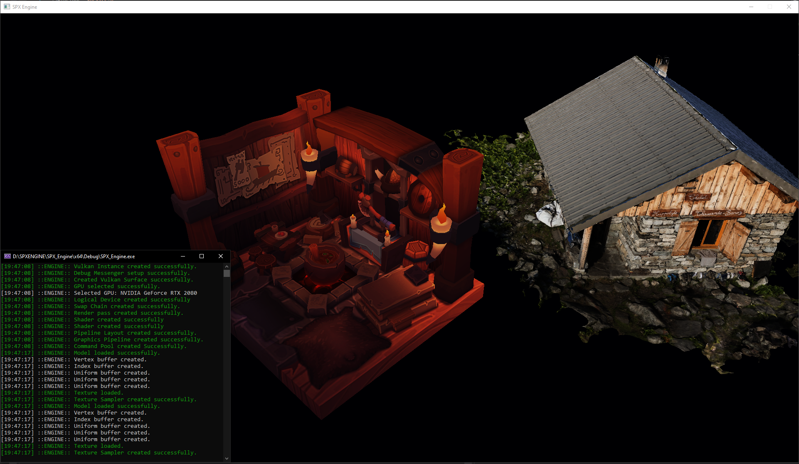

# SPX_Vulkan_Renderer

## This is a work in progress!!

SPX Vulkan Renderer

Currently the goals of this project is a simple 3D viewer with camera capabilities using the Vulkan API that I've abstracted into a wrapper.
This project is to teach me the flow of a graphics pipeline and the use of the Vulkan API and increase my knowledge of the C++ standard library and how it can be used.
This is also teaching me software architecture for a large project.

After the current goal is met, I plan to add onto it and increasing its functionality beyond a Renderer wrapper.

Currently the wrapper can render two seperate models and apply textures (with lighting baked in) to those models.

### Preview

_____________________________________________________________________________________________________________________________________________________________________

### Demo

In order to run the code, you will need to download and install the Vulkan SDK.
